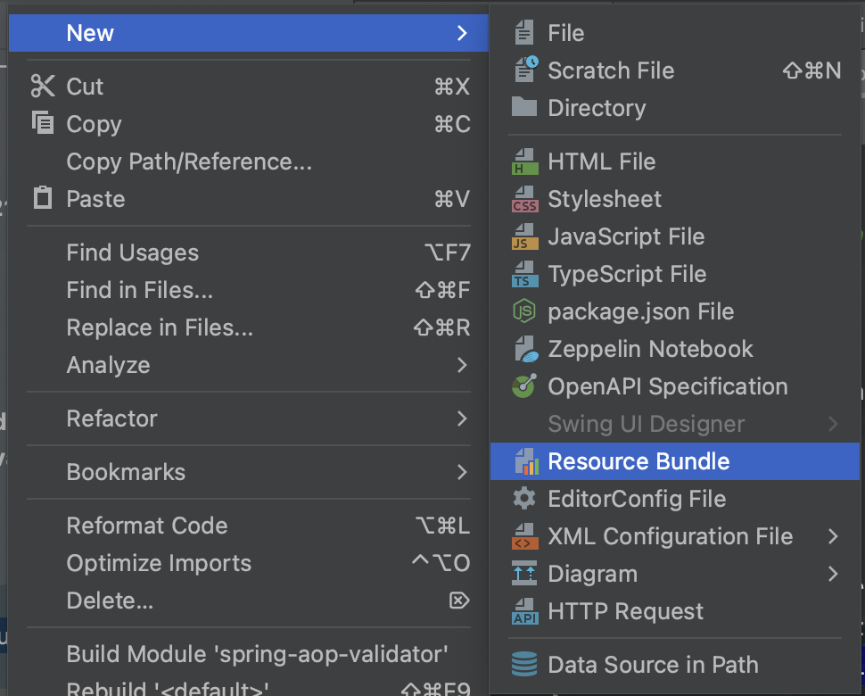
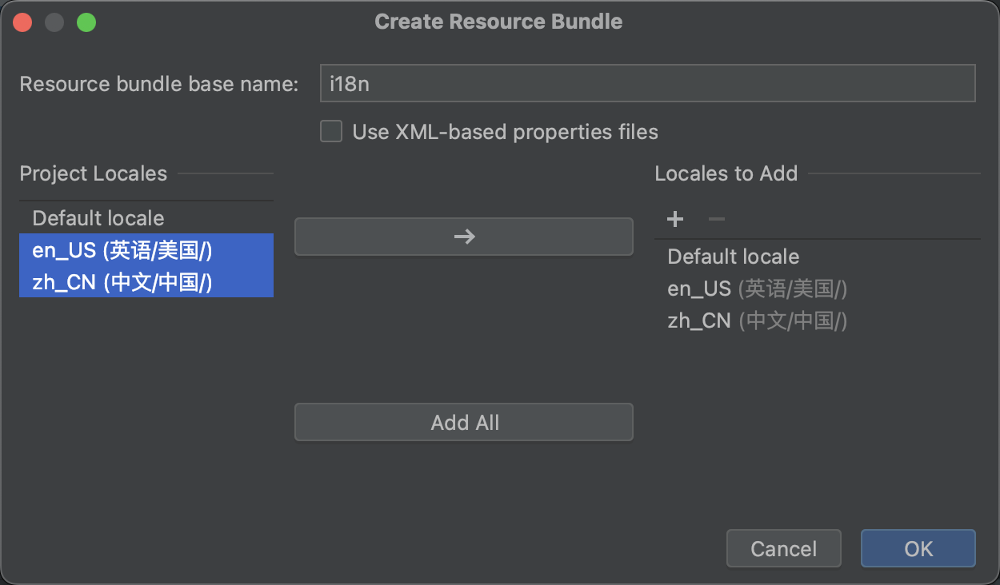
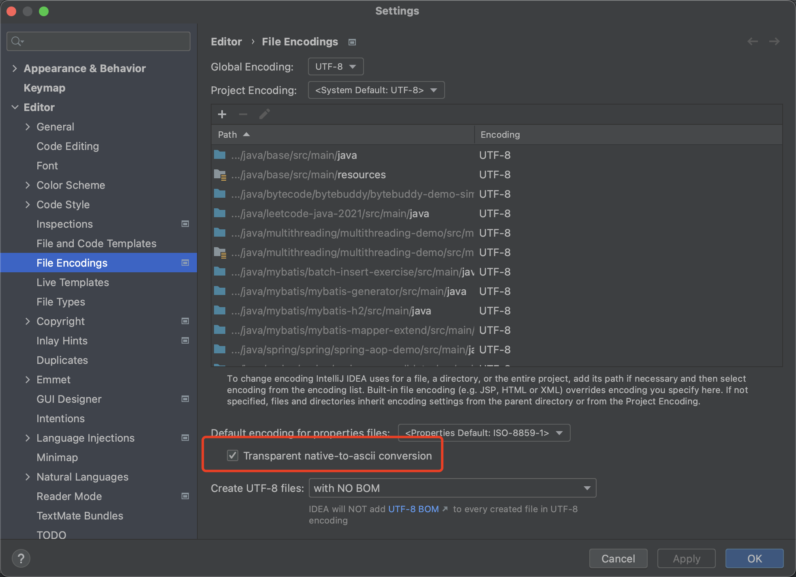

## Spring国际化——搭配Hibernate-Validate国家化

> 开发工具：IDEA
>
> Spring 版本：2.5.5
>
> JDK ：1.8
>
> Web环境

#### 核心依赖如下

```xml
	<parent>
		<groupId>org.springframework.boot</groupId>
		<artifactId>spring-boot-starter-parent</artifactId>
		<version>2.5.5</version>
		<relativePath/> <!-- lookup parent from repository -->
	</parent>
... ...
	<properties>
		<java.version>1.8</java.version>
	</properties>
	<dependencies>
		<dependency>
			<groupId>org.springframework.boot</groupId>
			<artifactId>spring-boot-starter-web</artifactId>
		</dependency>
		<dependency>
			<groupId>org.springframework.boot</groupId>
			<artifactId>spring-boot-starter-validation</artifactId>
		</dependency>
... ...
	</dependencies>
```
#### 添加国际化资源

首先在resource目录下新建message文件夹

> 也可以不建，后续配置资源文件路径时候不加即可，此处为了方便管理，统一放入一个目录下

在新建的文件夹下新建resource bundle



选择添加需要的国际化资源文件



添加资源内容

i18n_zh_CN.properties

```properties
test.message=你好 {0}
test.error=错误s
```


i18n_en_US.properties

```properties
test.message=hello {0}
test.error=error
```

> 注意：中文在IDEA做如下设置，否则需要自己转码
>
> 


#### 配置国际化消息路径

application.yml

```yaml
spring:
  messages:
    basename: message/i18n
```

#### 配置国家化解析器

国际化消息解析器，主要使用在web场景，由SpringMvc提供LocaleResolver接口，Spring提供了四种实现。

```java
/**
 * Interface for web-based locale resolution strategies that allows for
 * both locale resolution via the request and locale modification via
 * request and response.
 *
 * <p>This interface allows for implementations based on request, session,
 * cookies, etc. The default implementation is
 * {@link org.springframework.web.servlet.i18n.AcceptHeaderLocaleResolver},
 * simply using the request's locale provided by the respective HTTP header.
 *
 * <p>Use {@link org.springframework.web.servlet.support.RequestContext#getLocale()}
 * to retrieve the current locale in controllers or views, independent
 * of the actual resolution strategy.
 *
 * <p>Note: As of Spring 4.0, there is an extended strategy interface
 * called {@link LocaleContextResolver}, allowing for resolution of
 * a {@link org.springframework.context.i18n.LocaleContext} object,
 * potentially including associated time zone information. Spring's
 * provided resolver implementations implement the extended
 * {@link LocaleContextResolver} interface wherever appropriate.
 *
 * @author Juergen Hoeller
 * @since 27.02.2003
 * @see LocaleContextResolver
 * @see org.springframework.context.i18n.LocaleContextHolder
 * @see org.springframework.web.servlet.support.RequestContext#getLocale
 * @see org.springframework.web.servlet.support.RequestContextUtils#getLocale
 */
public interface LocaleResolver {
```

```java

/**
 * {@link LocaleResolver} implementation that simply uses the primary locale
 * specified in the "accept-language" header of the HTTP request (that is,
 * the locale sent by the client browser, normally that of the client's OS).
 *
 * <p>Note: Does not support {@code setLocale}, since the accept header
 * can only be changed through changing the client's locale settings.
 *
 * @author Juergen Hoeller
 * @author Rossen Stoyanchev
 * @since 27.02.2003
 * @see javax.servlet.http.HttpServletRequest#getLocale()
 */
public class AcceptHeaderLocaleResolver;
/**
 * {@link LocaleResolver} implementation that uses a cookie sent back to the user
 * in case of a custom setting, with a fallback to the specified default locale
 * or the request's accept-header locale.
 *
 * <p>This is particularly useful for stateless applications without user sessions.
 * The cookie may optionally contain an associated time zone value as well;
 * alternatively, you may specify a default time zone.
 *
 * <p>Custom controllers can override the user's locale and time zone by calling
 * {@code #setLocale(Context)} on the resolver, e.g. responding to a locale change
 * request. As a more convenient alternative, consider using
 * {@link org.springframework.web.servlet.support.RequestContext#changeLocale}.
 *
 * @author Juergen Hoeller
 * @author Jean-Pierre Pawlak
 * @since 27.02.2003
 * @see #setDefaultLocale
 * @see #setDefaultTimeZone
 */
public class CookieLocaleResolver;
/**
 * {@link org.springframework.web.servlet.LocaleResolver} implementation that
 * uses a locale attribute in the user's session in case of a custom setting,
 * with a fallback to the specified default locale or the request's
 * accept-header locale.
 *
 * <p>This is most appropriate if the application needs user sessions anyway,
 * i.e. when the {@code HttpSession} does not have to be created just for storing
 * the user's locale. The session may optionally contain an associated time zone
 * attribute as well; alternatively, you may specify a default time zone.
 *
 * <p>Custom controllers can override the user's locale and time zone by calling
 * {@code #setLocale(Context)} on the resolver, e.g. responding to a locale change
 * request. As a more convenient alternative, consider using
 * {@link org.springframework.web.servlet.support.RequestContext#changeLocale}.
 *
 * <p>In contrast to {@link CookieLocaleResolver}, this strategy stores locally
 * chosen locale settings in the Servlet container's {@code HttpSession}. As a
 * consequence, those settings are just temporary for each session and therefore
 * lost when each session terminates.
 *
 * <p>Note that there is no direct relationship with external session management
 * mechanisms such as the "Spring Session" project. This {@code LocaleResolver}
 * will simply evaluate and modify corresponding {@code HttpSession} attributes
 * against the current {@code HttpServletRequest}.
 *
 * @author Juergen Hoeller
 * @since 27.02.2003
 * @see #setDefaultLocale
 * @see #setDefaultTimeZone
 */
public class SessionLocaleResolver;

/**
 * {@link org.springframework.web.servlet.LocaleResolver} implementation
 * that always returns a fixed default locale and optionally time zone.
 * Default is the current JVM's default locale.
 *
 * <p>Note: Does not support {@code setLocale(Context)}, as the fixed
 * locale and time zone cannot be changed.
 *
 * @author Juergen Hoeller
 * @since 1.1
 * @see #setDefaultLocale
 * @see #setDefaultTimeZone
 */
public class FixedLocaleResolver;
```

> 由于hibernate-validate实现默认采用了从名为Accept-Language的http Header获取国际化语言，为此为了最简单实现，此处采用AcceptHeaderLocaleResolver的实现

```java
@Configuration
public class I18nConfiguration {
    
    @Bean
    public LocaleResolver localeResolver() {
        final AcceptHeaderLocaleResolver localeResolver = new AcceptHeaderLocaleResolver();
        // 添加支持的国际化消息
        localeResolver.setSupportedLocales(Stream.of(
                        Locale.US,
                        Locale.SIMPLIFIED_CHINESE)
                .collect(Collectors.toList()));
        return localeResolver;
    }
}
```

#### 实现简单的国家化接口

实现简单的支持国家化消息的接口。

```java
@Validated
@RestController
@RequiredArgsConstructor
@RequestMapping("/i18n")
public class I18nController {
    
    private final MessageSource messageSource;
    
    /**
     * i18n
     *
     * @param newUser info
     * @return success
     */
    @PostMapping("/message")
    public ApiResult<String> message(@RequestBody @Valid NewUser newUser) {
        return ApiResult.ok(messageSource.getMessage("test.message", 
                    new String[]{newUser.getName()}, LocaleContextHolder.getLocale()));
    }
}
```

测试中文

```http
### request
POST http://localhost:8080/i18n/message
Content-Type: application/json
Accept-Language: zh-CN

{
  "name": "name-test",
  "email": "test@163.com",
  "phone": "test@163.com",
  "blogUrl": "http://www.test.com/abc"
}

### response
{
  "status": 200,
  "message": "OK",
  "data": "你好 name-test"
}

```

测试英文

```http
### request
POST http://localhost:8080/i18n/message
Content-Type: application/json
Accept-Language: en-US

{
  "name": "name-test",
  "email": "test@163.com",
  "phone": "test@163.com",
  "blogUrl": "http://www.test.com/abc"
}

### response
{
  "status": 200,
  "message": "OK",
  "data": "hello name-test"
}
```

> 当输出validate校验失败的参数时依然支持国际化

#### 统一异常下国际化

采用统一异常管理器，在程序中自定义异常采用国际化消息提示错误消息

```java
public class I18nException extends RuntimeException {
    
    public I18nException(final String message) {
        super(message);
    }
}
```

ExceptionHandlers

```java
@Slf4j
@ResponseBody
@ControllerAdvice
@RequiredArgsConstructor
public class ExceptionHandlers {
    
    private final MessageSource messageSource;
    
    @ExceptionHandler(I18nException.class)
    protected ApiResult<Object> handleExceptionHandler(final I18nException exception) {
        final String message = messageSource.getMessage(exception.getMessage(), 
                                                        null, LocaleContextHolder.getLocale());
        log.error(message, exception);
        return ApiResult.error(message);
    }
}

```

模拟异常场景

```java
@Validated
@RestController
@RequiredArgsConstructor
@RequestMapping("/i18n")
public class I18nController {
    /**
     * error
     *
     * @return success
     */
    @PostMapping("/error")
    public ApiResult<String> error() {
        throw new I18nException("test.error");
    }
}
```

测试

```http
### request
POST http://localhost:8080/i18n/error
Content-Type: application/json
Accept-Language: zh-CN
### rresponse
{
  "status": 500,
  "message": "错误s",
  "data": null
}
```

```http
### request
POST http://localhost:8080/i18n/error
Content-Type: application/json
Accept-Language: en-US
### rresponse
{
  "status": 500,
  "message": "error",
  "data": null
}
```

#### 业务使用场景推荐

在实际业务场景中,统一管理国际化文案资源键，一般采用Message常量类实现，利用统一异常管理和统一消息体处理国际化文案。
